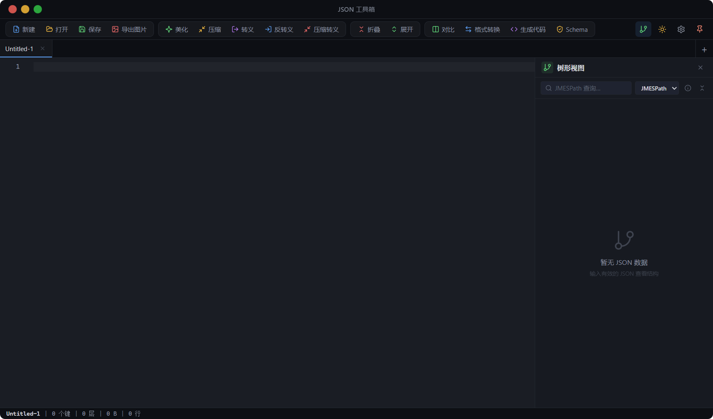

# JSON 工具箱

<p align="center">
  
</p>

<p align="center">
  <a href="https://github.com/firework-a/json-tools/releases"></a>
  <a href="https://github.com/firework-a/json-tools/releases"></a>
  <a href="https://github.com/firework-a/json-tools/actions"></a>
  <a href="https://tauri.app/"></a>
  <a href="https://react.dev/"></a>
  <a href="https://www.typescriptlang.org/"></a>
</p>

<p align="center">
  面向开发者的桌面 JSON 工作台 · 离线运行 · 原生窗口 · 轻量快速
</p>

---

JSON 工具箱是一个面向开发者的桌面 JSON 工作台，基于 Tauri 2、React 18 与 Monaco Editor 构建。它把常见的 JSON 处理流程整合在一个离线本地应用里，适合日常格式化、压缩、转义、格式转换、Schema 校验、多语言类型生成、对比与代码图片导出。

## 核心能力

- JSON 格式化、压缩、转义和解转义（粘贴单行 JSON 自动美化）
- 多标签页编辑，支持文件打开 / 保存 / 另存为，带未保存状态提示
- 文件拖拽打开（`.json` / `.txt` / `.yaml` / `.yml`）
- JSON 树形结构查看与查询
- JSON Diff 对比，支持行级差异高亮
- YAML / XML / TOML / CSV 格式转换
- JSON Schema 生成与校验
- TypeScript / Python / Go / Java / C# / Rust 多语言类型生成
- 代码图片导出
- 深色 / 浅色主题，字体、缩进、自动换行等编辑器设置持久化
- 窗口置顶、窗口原生拖拽与无边框标题栏
- GitHub Releases 内置更新检查

## 快捷键

| 操作 | 快捷键 |
| --- | --- |
| 新建标签页 | `Ctrl/Cmd + N` |
| 打开文件 | `Ctrl/Cmd + O` |
| 保存 | `Ctrl/Cmd + S` |
| 另存为 | `Ctrl/Cmd + Shift + S` |
| 美化 JSON | `Ctrl/Cmd + B` |

## 安装与更新

正式安装包通过 GitHub Releases 分发：

- **下载最新版**：<https://github.com/firework-a/json-tools/releases>
- **自动更新源**：<https://github.com/firework-a/json-tools/releases/latest/download/latest.json>

首次安装下载 Windows 安装包（`.msi` 或 `.nsis.exe`），安装完成后打开应用即可。

应用内更新入口位于 `设置 → 关于 → 检查更新`，新版本下载完成后点击“安装并重启”即可自动完成升级。更新包使用 Tauri 签名机制校验，确保分发链路可信。

## 开发环境

前置依赖：

- Node.js LTS
- pnpm
- Rust stable
- Tauri 2 所需的系统依赖（Windows 下推荐 Visual Studio C++ Build Tools + WebView2）

安装依赖：

```bash
pnpm install
```

常用脚本：

```bash
pnpm dev            # 前端开发（http://localhost:1420）
pnpm tauri dev      # 桌面端开发（Tauri 窗口）
pnpm typecheck      # TypeScript 类型检查
pnpm build          # 前端构建
pnpm build:app      # 打包当前平台安装包（release）
pnpm build:app debug  # 打 debug 包（快速、体积大）
pnpm build:app --target x86_64-pc-windows-msvc  # 指定 target
```

## 发布流程

1. 同步更新 `package.json`、`src-tauri/tauri.conf.json`、`src-tauri/Cargo.toml` 里的版本号。
2. 更新 `CHANGELOG.md`。
3. 确认 `src-tauri/tauri.conf.json` 中 `plugins.updater.pubkey` 为真实公钥（已配置）。
4. 在 GitHub Repository Secrets 中配置：
   - `TAURI_SIGNING_PRIVATE_KEY`
   - `TAURI_SIGNING_PRIVATE_KEY_PASSWORD`
5. 推送形如 `vX.Y.Z` 的 tag，或在 GitHub Actions 页面手动触发 `release` workflow。
6. Workflow 会自动构建 Windows MSI / NSIS 安装包、生成签名文件与 `latest.json`，并发布到 GitHub Release，旧版本即可收到更新。

本地也可执行 `pnpm build:app` 生成安装包和 updater artifacts，用于发布前验证。

若需要重新生成签名密钥：

```bash
pnpm tauri signer generate -w ~/.tauri/json-tools.key
```

私钥和密码请勿提交到仓库。

## 项目结构

```text
json-tools/
├── src/                    # React 前端
│   ├── components/         # 应用 UI 组件
│   ├── styles/             # Sass 样式
│   └── utils/              # JSON、文件、导出、更新等工具逻辑
├── src-tauri/              # Tauri 后端与打包配置
│   ├── capabilities/       # Tauri 权限配置
│   ├── icons/              # 应用图标
│   ├── src/                # Rust 入口（窗口、文件命令等）
│   └── tauri.conf.json     # Tauri 应用配置
├── scripts/                # 打包和维护脚本
├── docs/                   # README 引用的截图与文档资源
├── .github/workflows/      # CI 与发布工作流
├── CHANGELOG.md            # 版本更新说明
└── README.md
```

## 已知限制

- XML / CSV / TOML 等格式转换可能存在结构信息损失，不保证可逆。
- 超大 JSON（百万级节点）的树形渲染、Diff 与图片导出仍需要进一步性能保护。
- 更新分发完全基于 GitHub Releases，无独立更新服务器。
- Windows 代码签名、macOS 签名与 notarization 尚未配置，正式商业分发前需补齐。

## 后续路线

- 为核心 JSON 工具函数补充单元测试
- 最近打开文件与工作区状态恢复
- 大文件流式处理与性能保护
- 更完善的错误提示与首次使用引导
- 安装包代码签名与多平台（macOS / Linux）构建
